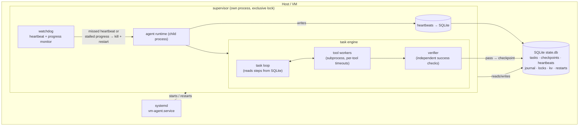
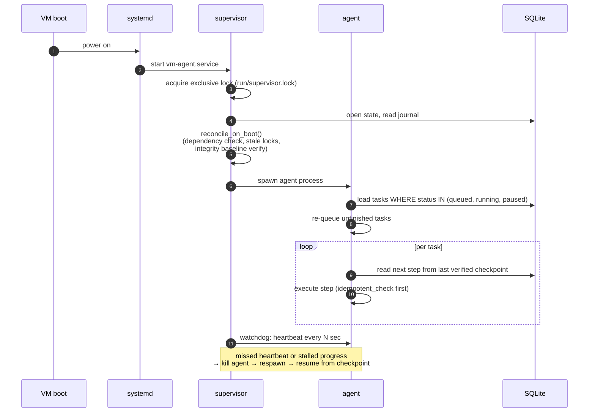
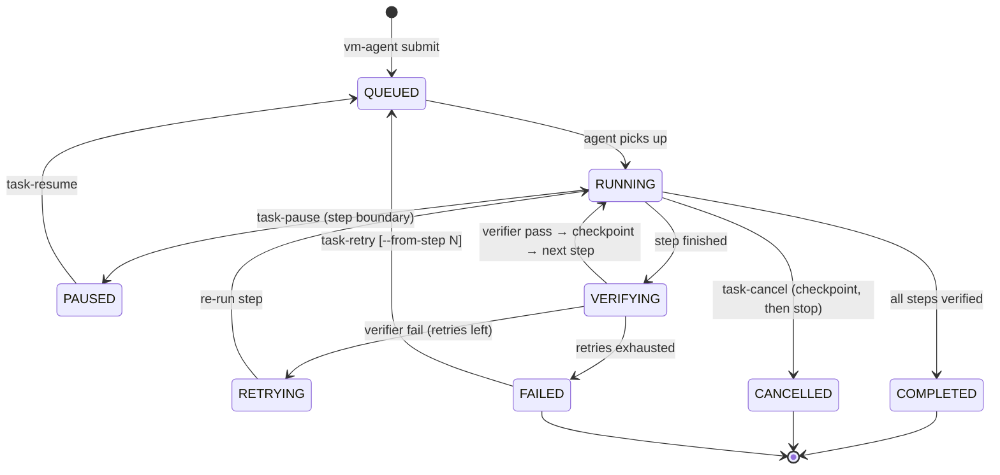
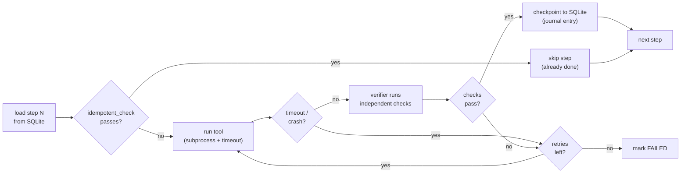

# vm-agent — persistent self-recovering computer-agent runtime


An agent runtime that **stays alive for as long as the VM runs**. It survives
terminal/SSH disconnects, detects hangs, recovers from crashes, verifies every
tool result independently, preserves task state in SQLite, and resumes
unfinished work after a reboot — with zero external dependencies (pure Python
stdlib).

## Table of contents

- [Why it exists](#why-it-exists)
- [The one fundamental limitation](#the-one-fundamental-limitation)
- [How it works (diagrams)](#how-it-works-diagrams)
  - [System architecture](#system-architecture)
  - [Boot and recovery flow](#boot-and-recovery-flow)
  - [Task lifecycle](#task-lifecycle)
  - [Step execution pipeline](#step-execution-pipeline)
- [Quick start](#quick-start)
- [Features in depth](#features-in-depth)
- [Task spec format](#task-spec-format)
- [CLI reference](#cli-reference)
- [Project layout](#project-layout)
- [Requirements](#requirements)
- [Testing](#testing)
- [Docs](#docs)

## Why it exists

A normal agent process dies the moment your SSH session drops, and with it
goes everything it was doing: half-finished work, tool state, progress. The
next run starts from scratch and from the LLM's (fallible) memory of what
happened.

vm-agent fixes that by making **SQLite the source of truth** instead of the
agent's memory:

- Every task step is persisted *before* it runs, checkpointed *after* it
  completes, and **independently verified** — the verifier decides success,
  not the LLM that proposed the step.
- A separate **supervisor process** (which the agent can never kill, since it
  isn't its child) watches heartbeats and progress. Missed heartbeats →
  hang detection → process kill → restart → resume from the last verified
  checkpoint.
- On VM boot, systemd starts the supervisor, the supervisor starts the
  agent, and the agent re-queues every unfinished task. Nothing is lost
  except what the VM being powered off takes with it (see below).

## The one fundamental limitation

**If the VM itself is powered off, nothing inside the VM can execute.**
Automatic recovery begins after the VM boots again: systemd starts the
supervisor → the supervisor starts the agent → the agent reloads SQLite
state → unfinished tasks resume from their last verified checkpoint.

## How it works (diagrams)

### System architecture



**Boundary rules (explicit, non-negotiable):**

| Proposes | Executes | Decides success |
|---|---|---|
| The LLM | The runtime | The **verifier** |

- The **supervisor** owns process continuity. The agent never supervises itself.
- **SQLite** is the source of task continuity. LLM context is never trusted.
- The **VM** is the ultimate execution boundary.

### Boot and recovery flow



### Task lifecycle



Crash at *any* point → supervisor restarts the agent → the task returns to
`QUEUED` and resumes from its **last verified checkpoint**, never from the
LLM's memory.

### Step execution pipeline



The `idempotent_check` is what makes resume-after-crash safe: if the step's
effects are already present, the step is skipped instead of re-run.

## Quick start

```bash
./install.sh                 # install (idempotent — safe to re-run)
vm-agent status              # supervisor + agent + tasks overview
vm-agent health              # JSON health (exits 0 only if fully up)
vm-agent submit task.json    # queue a task spec
vm-agent tasks               # list tasks
vm-agent logs                # tail agent log
vm-agent diagnostics         # heartbeats + recent journal
vm-agent recover             # show unfinished tasks (auto-resume on start)
vm-agent restart             # graceful restart via supervisor
vm-agent diagnose            # full one-command status summary
vm-agent locks               # list held locks
vm-agent interventions       # open human interventions
vm-agent world               # verified world state
vm-agent task-pause <id>     # pause a task (step boundary)
vm-agent task-resume <id>    # re-queue a paused/failed task
vm-agent task-retry <id> --from-step N  # re-queue from 1-based step N
vm-agent task-cancel <id>    # state-aware cancel (checkpoint, then stop)
vm-agent safe-mode status    # clock/dependency safe-mode state
vm-agent safe-mode exit      # leave safe-mode
vm-agent recover --dry-run   # preview recovery actions without applying
```

## Features in depth

- **Crash recovery** — the supervisor restarts a dead agent and unfinished
  tasks resume from their last verified SQLite checkpoint. Boot-time
  reconciliation re-queues anything left in a non-terminal state.
- **Hang detection** — the watchdog tracks both heartbeats *and* task
  progress. A process that is alive but making no progress is treated as
  hung: killed and restarted.
- **Independent verification** — every step's result is checked by the
  verifier (`file_exists`, `file_contains`, `command_ok`, `port_listening`,
  `http_ok`, `process_running`), not by the model that ran it. A step only
  counts as done when its checks pass.
- **Idempotent steps** — `idempotent_check` lets a resumed task skip work
  that already completed, so crash-recovery never double-applies effects.
- **Per-step retry caps** — retries are bounded per step; exhausted retries
  mark the task `FAILED` instead of looping forever.
- **Safe mode** — if the system clock jumps or dependencies look wrong at
  boot, the agent enters safe mode (with hysteresis, so a single glitch
  doesn't flap it) rather than running tasks against a broken environment.
- **Integrity baselines** — file integrity is recorded at install and boot,
  so tampering or corruption is detected on the next start.
- **Secret redaction** — resolved secret values are redacted from logs and
  journal output; secrets are never written to disk in cleartext (the auth
  token is written atomically with `0600` permissions).
- **Append-only journal** — every state transition lands in a daily JSONL
  journal, so you can always reconstruct *what happened and when*.
- **Human interventions** — tasks can request a human decision mid-run
  (`vm-agent interventions`) instead of guessing.
- **Verified world state** — `vm-agent world` shows the environment as the
  verifier sees it, not as any model claims it is.
- **Dry-run recovery** — `vm-agent recover --dry-run` previews exactly what
  recovery *would* do before it touches anything.
- **Stdlib only** — no pip packages, no services, no network calls required
  to run. If Python 3.8+ and SQLite exist, it installs.

## Task spec format

```json
{"steps": [
  {"name": "install nginx",
   "tool": "shell",
   "args": {"command": "apt-get install -y nginx"},
   "verify": [{"check": "command_ok", "command": "nginx -v"}],
   "idempotent_check": {"check": "command_ok", "command": "which nginx"},
   "retries": 2}
]}
```

`idempotent_check` makes resume-after-crash safe: if it passes, the step is
skipped. Steps without one re-run on resume (by design — declare idempotency).

Verify checks: `file_exists`, `file_contains`, `command_ok`,
`port_listening`, `http_ok`, `process_running`.

## CLI reference

| Command | What it does |
|---|---|
| `status` | supervisor + agent + task overview |
| `health` | JSON health; exit 0 only if fully up |
| `submit <file>` | queue a task spec |
| `tasks` | list tasks |
| `task-pause <id>` | pause at the next step boundary |
| `task-resume <id>` | re-queue a paused/failed task |
| `task-retry <id> --from-step N` | re-queue from 1-based step N |
| `task-cancel <id>` | checkpoint, then stop |
| `logs` | tail the agent log |
| `diagnostics` | heartbeats + recent journal entries |
| `diagnose` | full one-command status summary |
| `recover [--dry-run]` | show (or preview) unfinished-task recovery |
| `restart` | graceful restart via the supervisor |
| `locks` | list held locks |
| `interventions` | open human interventions |
| `world` | verified world state |
| `safe-mode status\|exit` | inspect / leave safe mode |
| `backup` | snapshot state |
| `dry-run` | validate a task spec without running |

27 commands total — see `vm-agent --help` and `docs/WIRING.md` for the full
command graph.

## Project layout (installed at ~/.vm-agent by default)

```
bin/vm-agent          CLI
lib/vmagent/          supervisor, agent, state, tools, verify, policy, cli
config/               config.json
state/state.db        SQLite (tasks, checkpoints, heartbeats, kv, restarts)
state/journal/        append-only event journal (JSONL per day)
checkpoints/          (checkpoints live in SQLite; dir reserved)
logs/                 agent.out, supervisor.out, diag-*.json
run/                  supervisor.lock, supervisor.pid
scripts/boot.sh       supervisor entry point (systemd ExecStart or manual)
```

## Requirements

- Python 3.8+ with `sqlite3` (stdlib — nothing to pip install)
- Linux with systemd (for auto-start on boot; without it, run
  `~/.vm-agent/scripts/boot.sh` manually or via your own init)

## Testing

```bash
python3 -m pytest tests/ -x -q
```

162 tests covering reliability, phase-3 behavior, CLI↔backend wiring, and
compound failure scenarios (crash mid-step, hang with live heartbeat, clock
jumps, corrupt state, and more).

## Docs

- INSTALL.md — installation & uninstall
- ARCHITECTURE.md — component design
- RECOVERY.md — recovery behavior
- TROUBLESHOOTING.md — common issues
- SECURITY.md — security model
- ENVIRONMENT.md — this VM's inspection report
- docs/WIRING.md — full CLI command graph (27 commands, zero broken edges)
- docs/ARCHITECTURE_AUDIT.md — audit history incl. the 14-fix hardening pass
